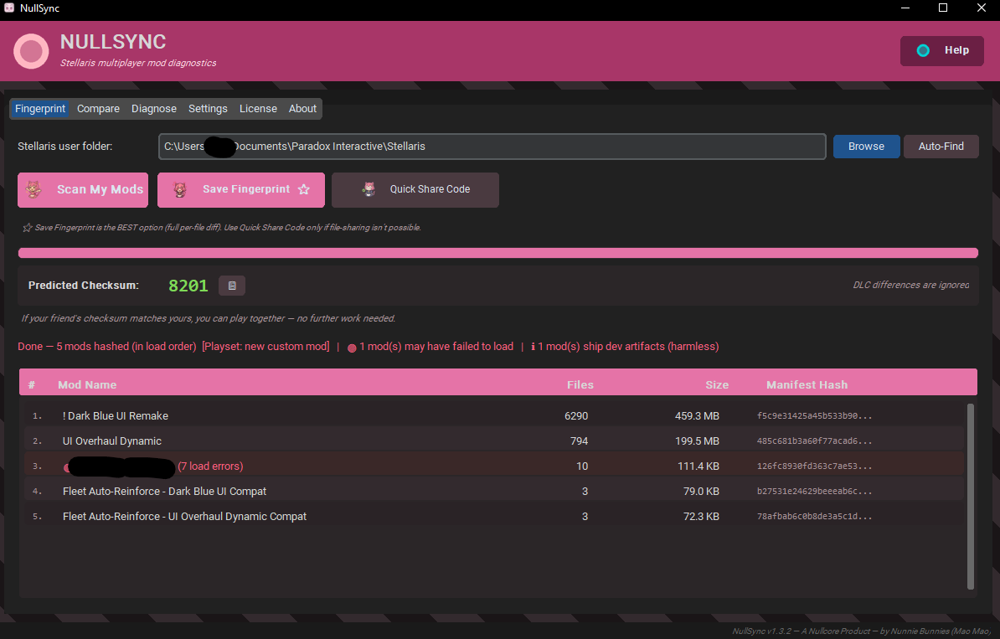
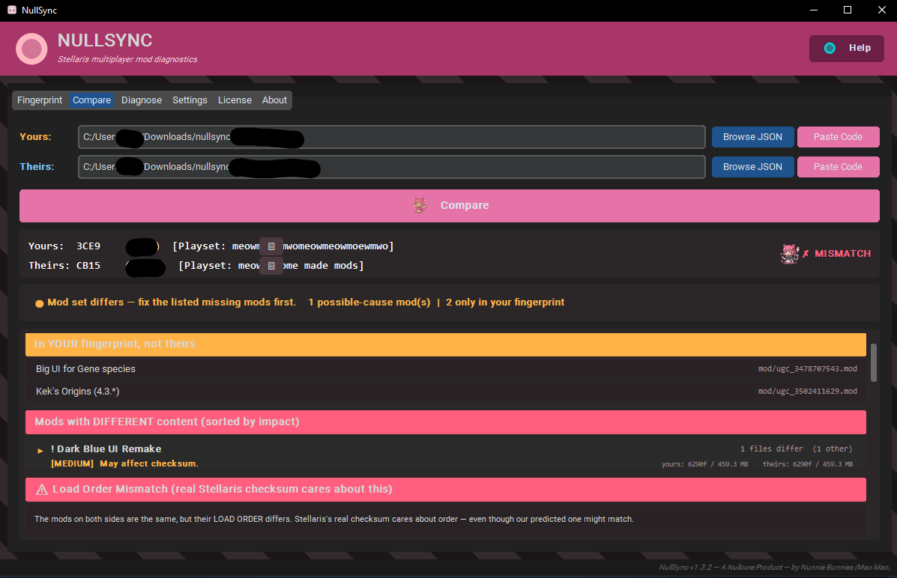
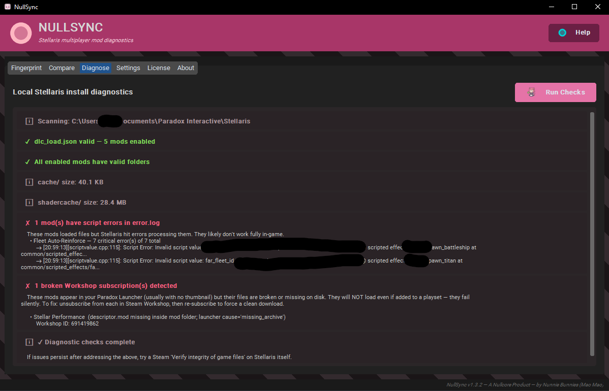

# NullSync

NULLSYNC automatically detects Stellaris multiplayer incompatibilities including mod mismatches, load order conflicts, altered files, DLC differences, and desync risks

> A desktop tool for diagnosing Stellaris multiplayer mod mismatches.

When you and a friend can't connect because of a checksum mismatch, NullSync compares your mod setups and tells you what's actually different. It works even when one of you has a mod that "looks installed" in the launcher but silently failed to load.

[**Download latest release →**](https://github.com/nunnie-bunnies/NullSync/releases/latest)

---

## Why NullSync exists

If you've played heavily modded Stellaris multiplayer, you've probably experienced this:

- same mod list
- same load order
- same game version
- same DLC

…but the lobby still says:

> **"Game version differs."**

Then begins the ritual:

- screenshots in Discord
- unsubscribe / re-subscribe
- reordering mods blindly
- comparing checksums manually
- restarting the launcher three times
- sacrificing an envoy to the checksum gods

NullSync exists to tell you exactly what's wrong instead of making you guess.

---

## Screenshots

**Fingerprint tab** - scan your mods, see your sync checksum and per-mod manifest.

**Compare tab** - paste your friend's share code, get a colour-coded breakdown of every difference: missing mods, content changes, load order mismatches.

**Diagnose tab** - one-click health audit of your Stellaris install. Finds broken Workshop subscriptions, mods with script errors in error.log, and other silent issues that ruin multiplayer.

---

## Features

- Fingerprints your active Stellaris mod setup (load order, file integrity, descriptor info)
- Generates a small share code you can send to a friend over Discord
- Compares two fingerprints side-by-side and explains every mismatch
- Generates a sync checksum from your setup - if yours matches your friend's, you'll connect
- Diagnose tab: catches broken Workshop subscriptions, mods with script errors, missing dependencies
- Three themes: Sakura, Cobalt, Midnight
- Windows 11 Acrylic glass effect (optional)
- Built-in update checker - notified when a new version ships

---

## Install

1. Grab `NullSync.exe` from the [Releases page](https://github.com/nunnie-bunnies/NullSync/releases/latest)
2. Run it. No installer, no admin rights, no extra files to manage
3. Settings persist to `%APPDATA%\NullSync\`

The first time you run it Windows SmartScreen may warn you about an unsigned binary - this is normal for small independent projects. Click **More info** then **Run anyway**.

---

## Quick start

**With a friend who can't join your game:**

1. Both of you open NullSync and click **Scan** on the Fingerprint tab
2. One person clicks **Share Code**, copies the result, pastes it in Discord
3. The other person opens the Compare tab and pastes the code there
4. NullSync displays every difference along with an explanation of what's likely causing the mismatch

**Just want to check your own install:**

Open the Diagnose tab and click **Run All Checks**. It will surface anything obviously broken about your Stellaris mod setup, even before you try to join a game.

---

## How It Works

NullSync scans your Stellaris installation when you click Scan. It reads which mods are active, the order they load in, and metadata about each one. From that it produces two things:

- A deterministic sync checksum derived from your mod setup. The checksum has one useful property: if two players see the same checksum, their setups are byte-for-byte compatible and they will connect cleanly
- A shareable fingerprint code that captures enough to compare against a friend's setup, without exposing anything personal about your machine

When you paste a friend's code, NullSync aligns both setups and identifies what's different - missing mods, version mismatches, files that diverge between the two of you, mods that loaded for one player but errored for the other.

The Diagnose tab runs a series of health checks against your install: misconfigured mod paths, broken Workshop subscriptions, mods showing critical errors in the game's own log, missing dependencies.

NullSync is **read-only**. It does not modify your Stellaris files, save data, mod files, or any game state. It does not connect to your game, only to your local filesystem.

---

## FAQ

**Is NullSync safe to run?**

Yes. It reads from your existing Stellaris files and writes only its own settings to `%APPDATA%\NullSync\`. It does not touch game files, mod files, saves, or anything outside its own settings folder.

**Does it phone home or collect any data about me?**

No usage data, no file contents, no analytics. The app does two small outbound calls on startup: one to GitHub's public release API to check for a new version, and one anonymous "I exist" heartbeat (sent at most once every 24 hours) so the project can count unique installs. The heartbeat sends only a hashed machine ID, the product name, and the version — no name, no email, no file paths. Both calls are gated by the same **Check for updates on startup** toggle in Settings — untick it and both stop.

**Why is the .exe so big (around 36 MB)?**

The binary bundles a Python runtime and all UI dependencies into one file so you don't have to install anything. Most of the size is the runtime, not NullSync itself.

**Do I need Python installed?**

No. The .exe is self-contained.

**Will it work on Linux or Mac?**

Not currently. Windows 10/11 (64-bit) only.

**Windows SmartScreen flagged the download. Is it malware?**

No. The binary is not code-signed (code signing certs are expensive for small indie projects). Windows treats any unsigned executable from a small distributor with suspicion by default. The download comes from this verified GitHub repository - if you want extra reassurance, scan the .exe with VirusTotal before running.

**Does NullSync support Stellaris with ironman or achievements enabled?**

NullSync is read-only and runs outside the game, so it has no effect on achievement eligibility.

**Will using NullSync change my Stellaris checksum?**

No. NullSync does not modify anything in your Stellaris folder. NullSync computes its own sync checksum from your setup, independent of Stellaris. Matching sync checksums between players means the underlying setups are identical, so the game will accept them together.

**My friend's share code is huge. Did I get it wrong?**

Share codes for normal mod lists fit easily in a Discord message. If the code is suspiciously long, you may have copied a full fingerprint JSON file instead. Use the **Share Code** button to generate the compact form.

**Can I use it to fingerprint a server, sync entire playsets, or push mods to my friend?**

No. NullSync is strictly a diagnostic tool. It doesn't transfer or install mods; that part still happens through the Paradox Launcher and Steam Workshop.

**Is this open source?**

No, NullSync is closed source. See [Source Code](#source-code) below.

---

## Troubleshooting

**"Stellaris directory not found"**

NullSync looks in standard locations under your Documents folder. If you've never launched Stellaris before, the directory won't exist yet. Run Stellaris once (even just to the main menu) so it creates the user folder, then try again. If you have Documents redirected to OneDrive or a custom location, use the **Browse** button to point NullSync at it manually.

**"No mods detected" / "Zero enabled mods"**

This usually means `dlc_load.json` is empty. Fix:

1. Open the Paradox Launcher
2. Activate your playset (or create one and add mods to it)
3. Click **Play** in the launcher - you can immediately quit once Stellaris is loading
4. This step is what tells the launcher to write your active mods to disk

Then re-run NullSync.

**Our sync checksums match, but Stellaris still won't let us connect**

Check the **Mod Load Health** section of the compare result. If a mod's files match between both players but it's failing to load on one side (script errors, missing dependencies), the in-game checksum will mismatch even when files are identical. NullSync flags this with a warning.

The fix is usually for the affected player to unsubscribe + re-subscribe to the broken mod, or to remove the mod from both playsets.

**The update banner says a new version is available, but I just downloaded NullSync**

Settings > About shows the version you're actually running. If it does not match the latest release tag, your download is stale. If versions match, your browser may have cached an older release page - refresh.

**Tooltips or buttons render outside their boxes / look glitched**

Try toggling the Glass Effect off in Settings, restart NullSync. Some Windows compositor configurations don't handle the Acrylic backdrop well.

**The app refuses to launch / crashes on startup**

Common causes:

1. Antivirus is quarantining unsigned binaries. Whitelist `NullSync.exe`
2. The settings file at `%APPDATA%\NullSync\settings.json` is corrupted. Delete it and relaunch
3. Conflict with another Python installation - this should never happen since the runtime is bundled, but rebooting tends to clear weirdness

If none of these help, open an [issue](https://github.com/nunnie-bunnies/NullSync/issues) with the steps to reproduce.

---

## Source Code

NullSync is closed source. Only the compiled binary is distributed.

GitHub automatically attaches "Source code (zip)" and "Source code (tar.gz)" archives to every release - these are auto-generated from this repository and **only contain documentation files** (README, LICENSE, CHANGELOG). They do not contain the application source.

---

## System requirements

- Windows 10 or 11, 64-bit
- Stellaris installed via Steam
- ~80 MB free disk
- Internet connection on startup if update checks are enabled (optional)

---

## Reporting issues

Use the [Issues tab](https://github.com/nunnie-bunnies/NullSync/issues) for bugs and feature requests. Include:

- Your NullSync version (Settings > About)
- Steps to reproduce
- What you expected vs what happened
- Your Stellaris version (Paradox Launcher shows it on the right)
- Any error message NullSync displayed

---

## Helping out

NullSync is early and there's a lot still being smoothed over. If you'd like to help test new features before they ship, give feedback on rough edges, or play co-op Stellaris sessions to validate mod setups against real multiplayer, hop into the [Discord](https://discord.gg/DRXRnPDmbJ) and say hi. No prior experience needed.

---

## License

All rights reserved. See [LICENSE](LICENSE) for full terms.

Free to download and use for personal Stellaris play. Redistribution, reverse engineering, and modification are not permitted.

---

**NullSync** - A Nullcore Product - by Nunnie Bunnies (Mao Mao)
